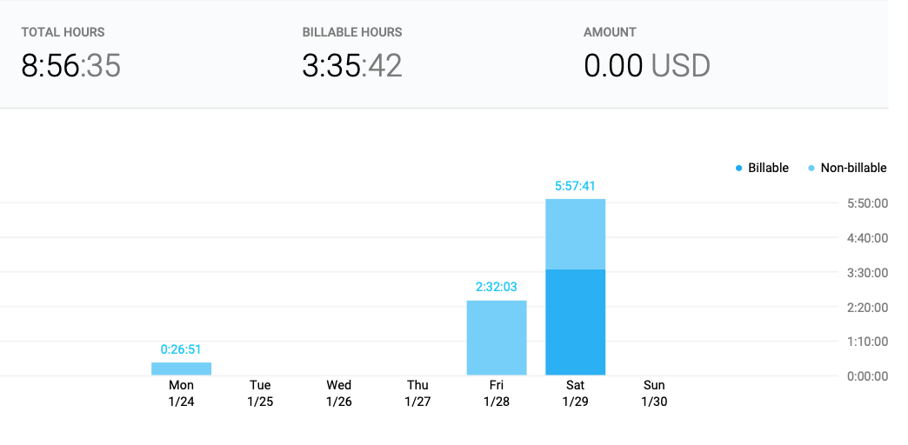
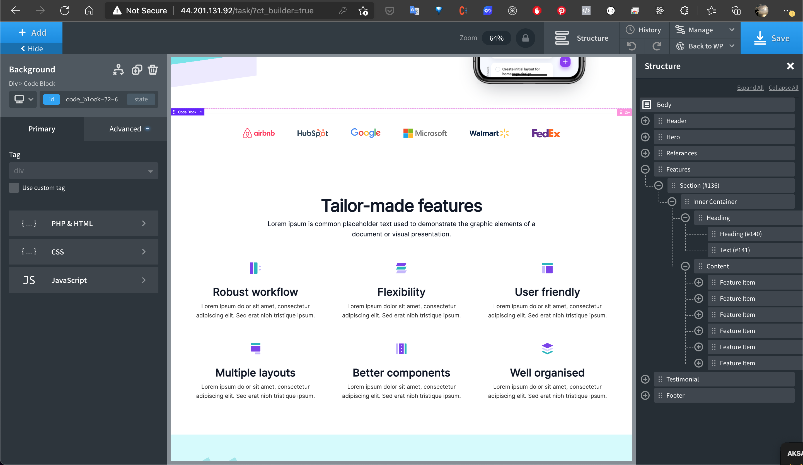
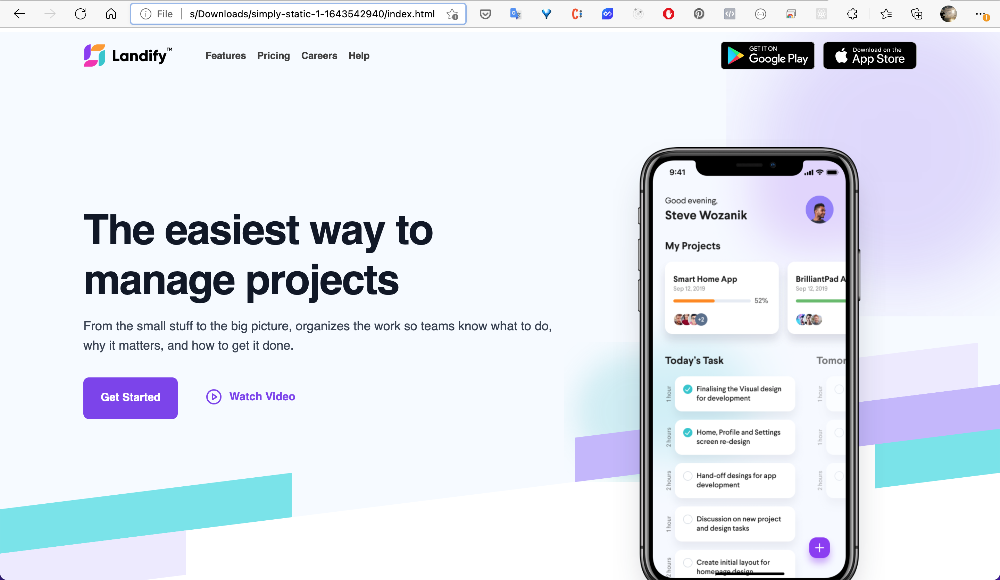

## Design to Code

**Fully Responsive Landing Page.**

This project made with **WordPress** + **Oxygen Builder**.
This is my first project on **WordPress** and **Oxygen Builder**

---

Project Steps:
1- Analyze the design. - [Design - Landify](https://landify.design/)
2- Determine the estimate time for each parts of the design.
3- Setup WordPress + Oxygen Builder 
4- Code it. 

Thanks;

- [Design - Landify](https://landify.design/)
- [aws.amazon](https://aws.amazon.com/tr/)
- [wordpress.org](https://wordpress.org/)
- [How to Host wordpress website in AWS for Free. Launch a Wordpress Website - AWS](https://youtu.be/5qxZj-PbAN0)

Said Furkan Dize
Regards
